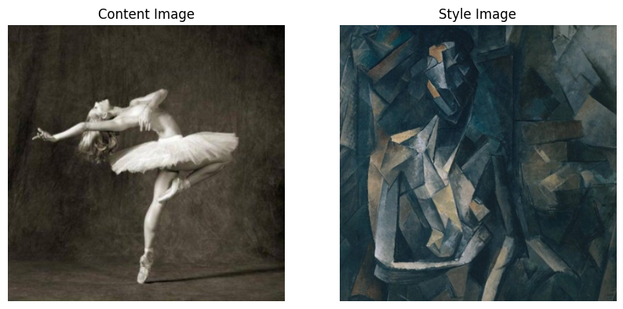
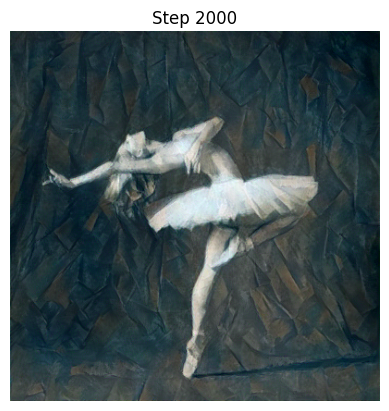

# Neural Style Transfer with PyTorch

## Описание проекта

Этот проект демонстрирует реализацию алгоритма **Neural Style Transfer (NST)**, который позволяет комбинировать стилистические элементы одного изображения (стилевого изображения) с семантическим содержанием другого изображения (контентного изображения). В основе подхода лежит использование предобученной сверточной нейронной сети (VGG19) в качестве извлекателя признаков и оптимизация входного изображения для минимизации потерь контента и стиля.

Цели проекта:
* Понять, как сверточные нейронные сети извлекают и представляют признаки изображений.
* Реализовать функцию Грама-матрицы для оценки стиля.
* Провести оптимизацию пикселей изображения для достижения желаемого стиля.
* Визуализировать процесс стилизации и конечный результат.

## Содержание репозитория

* `neural_style_transfer.ipynb`: Основной Jupyter Notebook, содержащий весь код для загрузки данных, подготовки модели VGG, определения функций потерь, оптимизации и визуализации.
* `images/`: Директория, содержащая примеры исходных контентных и стилевых изображений, а также полученные стилизованные результаты.
* `requirements.txt`: Список всех зависимостей проекта.

## Используемые технологии

* **Python**
* **PyTorch:** Основной фреймворк для построения нейронной сети и выполнения оптимизации.
* **Torchvision:** Для загрузки предобученных моделей (VGG19) и преобразований изображений.
* **PIL (Pillow):** Для работы с изображениями.
* **Matplotlib:** Для визуализации.
* **NumPy:** Для численных операций.
* **Requests, io:** Для загрузки изображений по URL.

## Установка и запуск

Чтобы запустить этот проект локально, выполните следующие шаги:

1.  **Клонируйте репозиторий:**
    ```bash
    git clone [https://github.com/YourUsername/neural-style-transfer-pytorch.git](https://github.com/YourUsername/neural-style-transfer-pytorch.git)
    cd neural-style-transfer-pytorch
    ```
    (Замените `YourUsername` на свой никнейм на GitHub.)

2.  **Создайте виртуальное окружение и установите зависимости:**
    ```bash
    # С использованием venv
    python -m venv venv
    source venv/bin/activate  # Для Linux/macOS
    # venv\Scripts\activate   # Для Windows
    pip install -r requirements.txt
    ```
    **Примечание:** Для установки PyTorch с поддержкой GPU (если у вас есть CUDA), следуйте инструкциям на официальном сайте PyTorch, так как команда может отличаться: [https://pytorch.org/get-started/locally/](https://pytorch.org/get-started/locally/)

3.  **Запустите Jupyter Notebook:**
    ```bash
    jupyter notebook neural_style_transfer.ipynb
    ```

## Примеры результатов

| Исходные изображения                     | Стилизованное изображение           |
|------------------------------------------|-------------------------------------|
|   |  |
